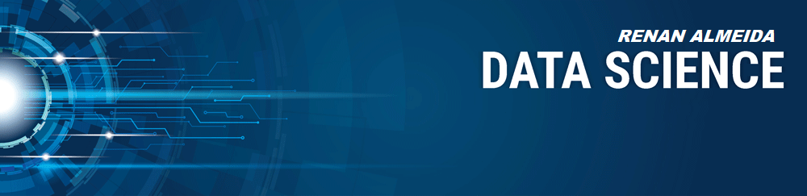

   

  

# Renan Almeida
*Data Scientist*

• Suporte Mainframe

• Elaboração de comitê tático operacional Mainframe com as áreas do Suporte Técnico Mainframe

• Conhecimento Processo ITIL V3

• Investigar e resolver problemas de desempenho usando ferramentas como: RMF, SMF, TDS, WLM, Mainview para z / OS

• Realizar relatórios do sistema e análise de capacidade

• Ajustando o desempenho das LPARs, reduzindo assim o consumo de MSU / MIPS, melhorando os tempos de resposta e reduzindo os tempos de processamento batch.
 

**Background in:** Python, Machine Learning, Space Operations and Mathematical Optimisation.

**Links:**
* [Blog recomendado ](http://sigmoidal.ai)
* [LinkedIn](https://www.linkedin.com/in/renan-almeida-2a55702b)
* [Medium](https://www.medium.com)

## Projetos:
Veja os tutoriais publicados do Sigmoidal:

* **Análise do Titanic:** https://bit.ly/2BnwLn4

